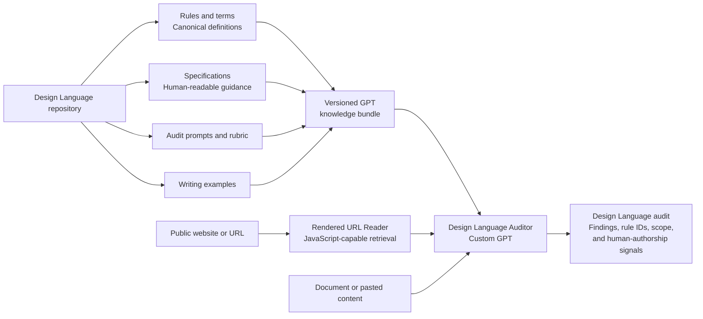

Artwork by [burge.design](https://www.instagram.com/burge.design/).

# Design Language

Design Language is a portable editorial and interface language system for human and AI-assisted workflows.

Its purpose is practical: make content more consistent, easier to scan, and less likely to carry generic AI writing patterns.

## Use it today

Use the audit prompts in `audit/prompts/` with a document, website, interface, presentation, or case study. The auditor reports findings by rule ID and does not rewrite unless asked.

For a guided audit, try the public [Design Language Auditor](https://chatgpt.com/g/g-6a52996c067481919f69cde33a25b22d-design-language-auditor) GPT.

If you are evaluating a webpage created with Figma Make, the optional [Figma Make audit guide](docs/figma-make-audit-guide.md) provides a step-by-step workflow, version-pinned knowledge files, persistent guidelines, human-authorship signals, and approval checkpoints before revisions.

## Repository model

- `spec/` explains the language system for people.
- `rules/rules.yaml` is the canonical machine-readable rule set.
- `audit/` defines scoring, severity, report structure, and reusable prompts.
- `adapters/` provides thin instructions for AI-assisted tools.
- `examples/` shows preferred and discouraged patterns.
- `decisions/` records why important rules exist.

## How the repository and GPT work together

The repository is the source of truth. Each GPT release stores its published instructions, conversation starters, action schema, and knowledge files under [`gpt/`](gpt/).

## Core principle

Markdown explains the system. Structured data defines it. Adapters distribute it.

## Version

Current version: `1.0.1`

## Audit philosophy

Design Language separates evaluation from transformation.

An audit identifies issues.

A rewrite is a separate operation requested by the user.

Every website audit reports the scope that was evaluated.

## Project direction

- `docs/vision.md` defines the long-term direction.
- `docs/project-charter.md` defines how the project operates.
- `docs/non-goals.md` defines what DSL is not.
- `docs/sprint-1.md` preserves the active sprint.
- `docs/custom-gpt-release-process.md` keeps the Custom GPT aligned with each release.
- `gpt/README.md` documents the published GPT configuration and version history.

## Design Language Auditor

Public GPT:

https://chatgpt.com/g/g-6a52996c067481919f69cde33a25b22d-design-language-auditor

## Rule reference

Use [`docs/rule-reference.md`](docs/rule-reference.md) for a readable list of rule IDs, titles, severity levels, and plain-language meanings. The canonical machine-readable registry remains [`rules/rules.yaml`](rules/rules.yaml).

The GPT should be updated alongside every DSL release following `docs/custom-gpt-release-process.md`.
